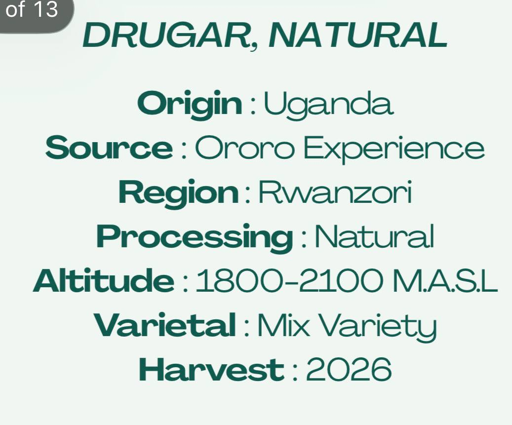
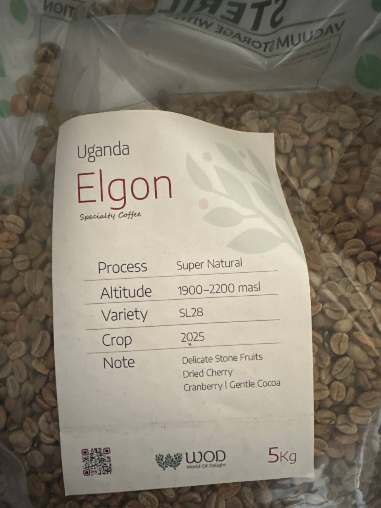
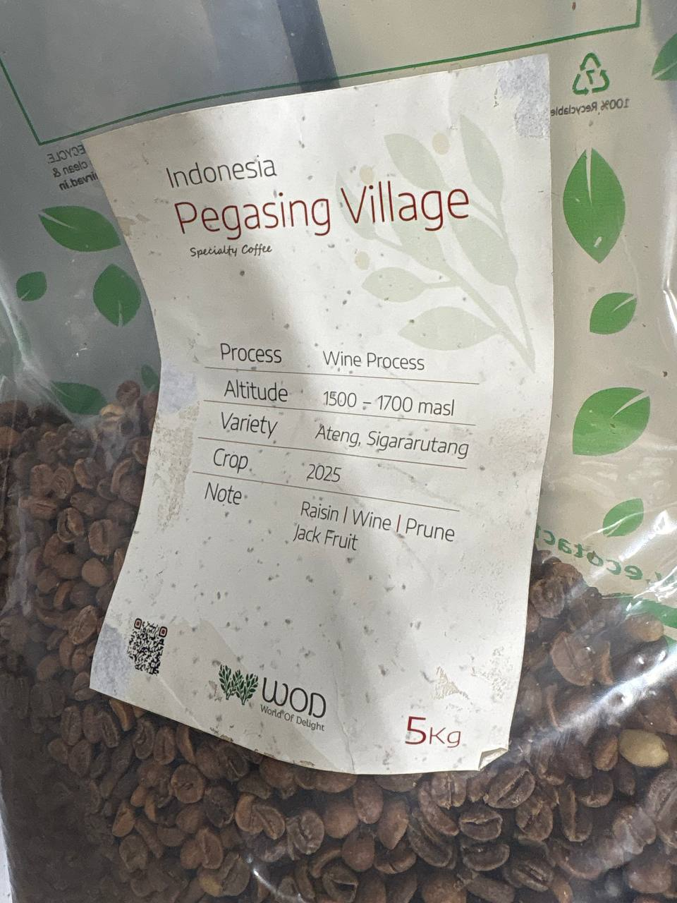

### Uganda Bulambulli Anaerobic Natural
Variety: SL-14 & SL-28  
Altitude: 1600–2100m  
Crop Year: 2026  
Flavor Notes: Pineapple, Mango, White Grape, Caramel

---

### Bugisu AA
Process: Washed  
Variety: SL-14, SL-28, Typica, Kent  
Flavor Notes: Chocolate, Sweet Tropical Fruits  
Body: Heavy  
Score: 84

---

### 50/50 Blend
Roast Level: Medium Roast  
Body: Medium to High  
Acidity: Low  
Bitterness: Medium  
Flavor Notes: Chocolate, Nutty, Brown Sugar, Sweet Almond

---

### ۵۰/۵۰
درجه رست: مدیوم رست  
تن‌آوری: متوسط رو به بالا  
اسیدیته: نسبتاً کم  
تلخی: متوسط  
طعم‌یادها: شکلات، آجیلی، شکر قهوه‌ای، بادام شیرین

---

### بولامبولی اکسپریمنتال نچرال
خاستگاه: اوگاندا  
زیرگونه: SL28 - SL14  
فرآوری: نچرال تجربی (عسلی بی‌هوازی)  
ارتفاع: ۱۸۰۰ تا ۲۰۰۰ متر  
طعم‌یادها: میوه‌های استوایی، یوزو، واینـی (شرابی)

---

### BULAMBULLI EXPERIMENTAL NATURAL
Origin: Uganda  
Variety: SL28 - SL14  
Process: Experimental Natural (Honey Anaerobic)  
Altitude: 1800–2000m  
Cupping Notes: Tropical Fruit, Yuzu, Winey

---

### Ethiopia Yirgacheffe
Origin: Ethiopia  
Region: Yirgacheffe  
Process: Natural  
Variety: Heirloom  
Altitude: 1800–2200 MASL  
Flavor Notes: Stone Fruits, Grapefruit, Milk Chocolate  
Suitable for Espresso & Filter

---

### اتیوپی یرگاچف
خاستگاه: اتیوپی  
منطقه: یرگاچف  
فرآوری: نچرال  
زیرگونه: خودرو  
ارتفاع: ۱۸۰۰ تا ۲۲۰۰ متر  
طعم‌یادها: میوه‌های هسته‌دار، گریپ‌فروت، شکلات شیری

---

Dried Fruit, Pleasant Acidity, Nutty, Caramel
